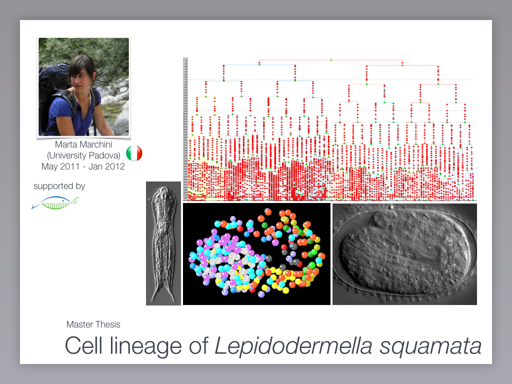

# Neptune Computational Biology - Final Project - Viviana

# Cell distance calculation in the cell lineage of the *Lepidodermella squamata*(Gastrotrich) 

## Introduction and Goals

The goal of this project is to calculate the distance between cells in a cell lineage of *Lepidodermella squamata*.

In order to do this, I used scipy and numpy libraries in Python for calculating the distance between the labeled cells in the cell lineage.

The data I used are from Andreas Hejnol lab, Sars Centre (Bergen, NO). Unfortunatly, I don't know much about these data, so I made some assumption.

## Methods

I used 

## Result

The result is shown in this link [python_output](out.txt)

